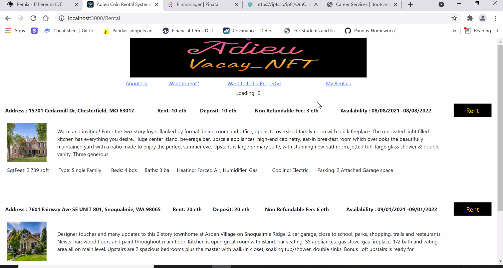
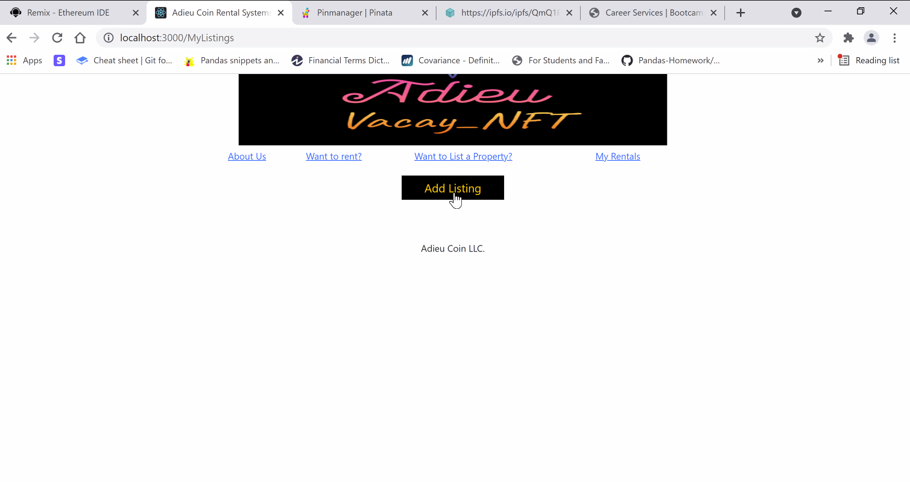
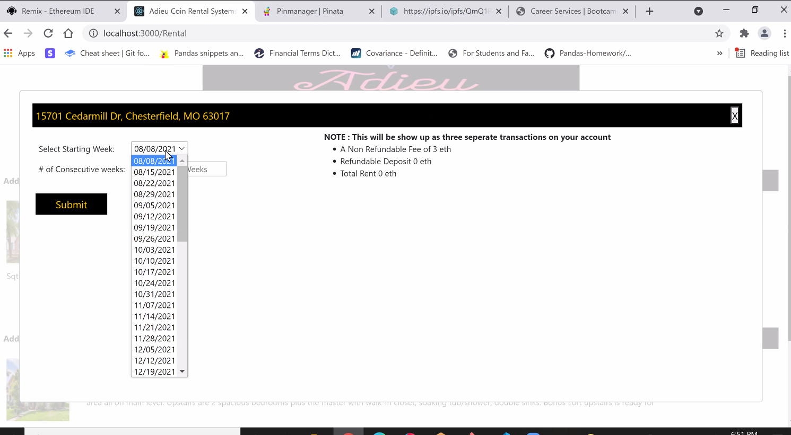
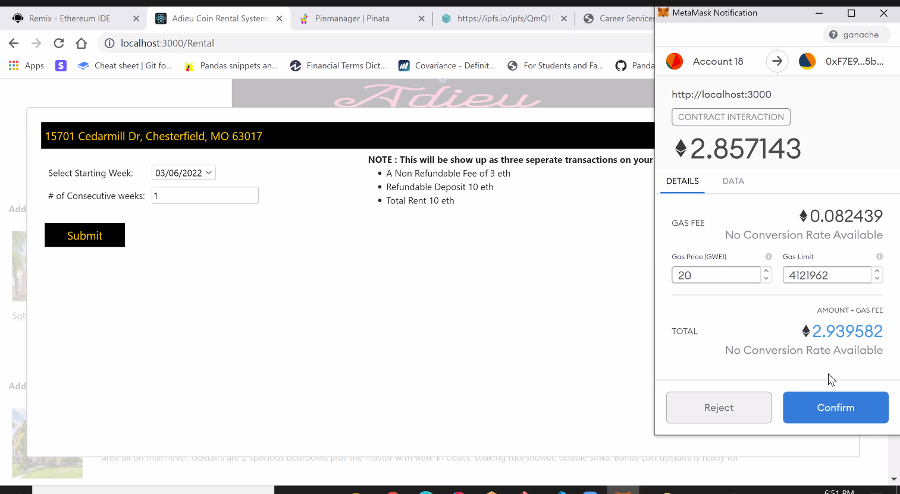
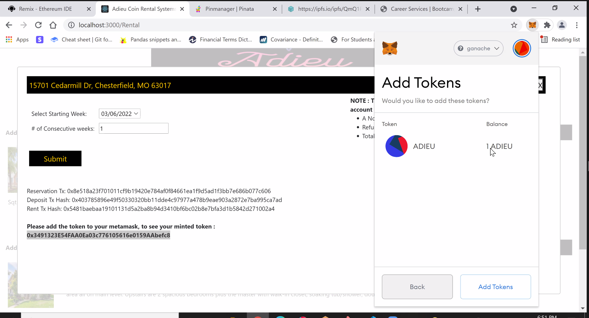

# AdieuCoin : Vacay NFT 

## We Created a dual-sync / one-chain NFT 

Both for property owners ("owners") as well as Vacationers ("renters"). 

<u> Vacay ! </U>

<u>***Mint as you go***</u> tokenomics ensure that both owners and renters have unique NFT Tokens to add to their collection when renting unique and fun properties.
This is the first working blockchain ERC721 implementation of bi-directional; 100% on-chain renting completely cutting out the "middleman" problem ENTIRELY.
Renters and Owners communicate, interact, and transact directly.  

The Adieu platform is NOT an interested party nor a middleman; rather it's a hosting entity that prefers everything (when possible) be written and transacted ON the blockchain. Adieu does not have ownership, management, oversight, or any control whatsoever once contracts deploy on Mainnet. 

## Inital Parameters: 
***Balance*** We had to choose between convenience, feasibility, timing, and advanced features with limitations on all of the foregoing. 
Even so, a balanced approach and leveraging 4 members in our group, we were able to set initial parameters as follows 

* ERC 721 Standard **see contracts***
#### [SMART CONTRACTS HERE ](smart_contracts)
* NFT Token 
* 4 contracts within the body of deployment 
* 2 governance/management contracts 
* 2 payload contracts (1 token per contract) 
* 1 governance contract : oversees OWNER functions 
* 1 governance contract : oversees RENTER functions 
* IPFS - used as "side-chain" back-end augmenter *not everything should be on the blockchain* 
* React.JS package - deployed as front-end to 

  * add listings 
  * update listings 
  * price, shop, and rent 
---

##  The Ingredients of a  crypto Soufflé to ensure maximum airiness   
#### THE TOKENS
* ERC 721 - contracts w/ full inheritance & **openzeppelin** integration
* Single Chain with / transaction dependent- dual-series NFT tokens 
    * once a property NFT is minted (Owner) token; 
    * another series of NFT tokens can then be minted for (Renters) - Adieu Token
* While both series are separate tokens - Owner tokens are independent & Renter tokens are dependent
* Owner Tokens can be listed - on property listings that meet the staking & deposit requirements
* Renter tokens must then be tied to a particular property (e.g. *renting* that property)

#### Future fungible"ness" and ***value***
* Each Unique Token represents 2 non-fungible features 
      1. The rightful and exclusive access to a piece of real estate; 
      2. ***and*** that access for a specified period of time

The value of NFTs at launch denote nothing other than posession or ownership, an additional feature may include future value, secondary market value, and/or proof of residence, use, locale, and/or tax expenditures (in the future).  Because NFTs and digital tokens in general are still very new, the possessory and use implications are still unknown. 

#### IPFS 
* IPFS - off-chain storage 
#### [See JSON-Files for IPFS :HERE](frontend/src/components/data/)
   * not all data is created equal 
   * outside of recording transactions and minting tokens the blockchain is rudimentary, expensive, and small 
   * using IPFS - we can still MAP and tie URIs to NFTs 
   * IPFS - once duplicated upon several nodes is quite literally affixed or permanent in the etherverse 
 
 #### Plating your dessert 
* Finally - to synthesize all efforts and help with bugfixing and testing
    * launching with React.JS
    * a suitable front-end that updates livetime 
* ***metamask*** integration - for live-testing 
---
## Ingredients Complete - Now to assemble the Soufflé
* Limited testing performed on Ropsten & Kovan 
* Most extensive testing performed on Local Blockchain via ***Ganache***

#### REACT.JS created 
Remix while sufficient for rudimentary testing and demonstrative contract deployment - simple function testing; we found it's use limiting for larger contracts and multi-contract projects, which ***Adieu*** subscribes. 

React - Fully Active & Single Page framework to deliver ***reactive*** content without needing to load multiple or new html web pages 
* multiple components; 
* active front-end; 
* ability to ***"LIST"*** properties 
* ability to ***"SELECT"*** duration (in weeks)
* ability to ***"RENT"*** 
* ability to ***"Connect METAMASK"*** 
* ability to ***"MINT"*** Tokens 
* Demonstrates the power of the attendant Smart Contracts 
* Proof of Concept for a truely ***TRUSTLESS*** and ***CENSORSHIP RESISTANT*** peer-to-peer network with ***NO MIDDLEMAN*** 

###  Future & Improvements 
* bugfixing was limited and less than transparent given Remix's interface; 
* bugfixing via truffle - continuously ran into compiling errors, even though Remix worked; 
* ERC 1155 would have been the ideal protocol - we wanted to keep this project as simple as possible, but in reality, would have yielded better contracts and access management with the updated final standard: future implementation; 
* At current IPFS - is still a manual read/write process requiring a platform admin to review listing submissions before entry into IPFS to output ID hash; 
* Future IPFS implementation will be auto-populated with Pinata; 
* the listing requirements may have to be more draconian - spoofing properties is a real human issue we anticipate may happen; 
#### Who Wouldn't want to rent the Playboy Mansion for a week for ***only*** $500 ? ! ? 
While we created this platform to be as trustless and middleman-free as possible; with the added notion and understanding that once released on Mainnet, it will either be a runaway freight train, or a perfectly bug-free platform - the REAL challenges are as always: HUMAN.  

* Launching to testnet with at least 2 or 3 Etherscan - paired Audits (public and fully accessible); 
* Improving contracts' byte-size utilization and efficieny runtime; 
* Implementing ***ROLES*** and use access management to create operational segregation between contract owners (founders) and the public users:
   Adieu Token is meant to be ***truly*** peer-to-peer. No Helpdesk. No customer service. No KYC. No key retrieval. No "accidents" 
   Users are their own managers as well as patrons. Users Hold all the keys to their own wallet, token, use, and peer-to-peer interaction 
   The truest iteration of a successful rental coin platorm is that Owners and Renters win. Transactions are self-managed and self-executing. Nobody can 'spam' users. 
   Nobody can de-list or de-boost listings or transactions.  Nobody can censor content or try to scam users, then erase all traces of malfeasance. IPFS hosting off-chain content
   and blockchain hosting on-chain content significantly reduces the risk of: 
   
      * unsophisticated users losing all their money; 
      * a bare standard of technical competency in digital transactions and more specifically - ***blockchain & private wallets*** is required; 
      * spammers and spoofers - there are high deposit requirements for both owners and renters; 
      * sufficient codebreaking on smart contracts yields multiple confirmations, multiple require conditions, and multiple warnings before transactions are recorded to the blockchain

* Perhaps most forward-thinking - creating a TESTNET - layer on top of the entire REACT website. 
* Once users complete a full cycle of either LISTING or RENTING - they will receive a ***"TRAINED"*** NFT 
* ***TRAINED*** COIN - signature will be the condition precedent to unlocking the mainnet to begin live transactions 

--- 
# A preview of a working REACT front-end 

### Loading up the local blockchain & REACT locally hosted server - you can see that the REACT core "components" are displaying properly 

 
### A proprety owner or landlord/manager - goes through the process of interacting with the blockchain & prepare to list one's property

 
### Any public person who knows how to actuate a crypto wallet can browse, time, and calculate rent for any of the available property listing. 

 
### Once selected, a renter will have the opportunity to execute wallet functions for 
1. non-refundable deposit 
2. refundable deposit 
3. and finally- the rent 

### After payment rendered, the renter now has a non-fungible and 100% Unique TOKEN 
### BEAUTIFUL 

---
### If you've made it this far, then here is the full list of directories in this repository for easy navigation: 
#### [REACT_base_files](frontend)

#### [Powerpoint Slides: Presentation](presentation)

#### [SmartContracts: solidity Files](smart_contracts)

### Until next time . . . 
